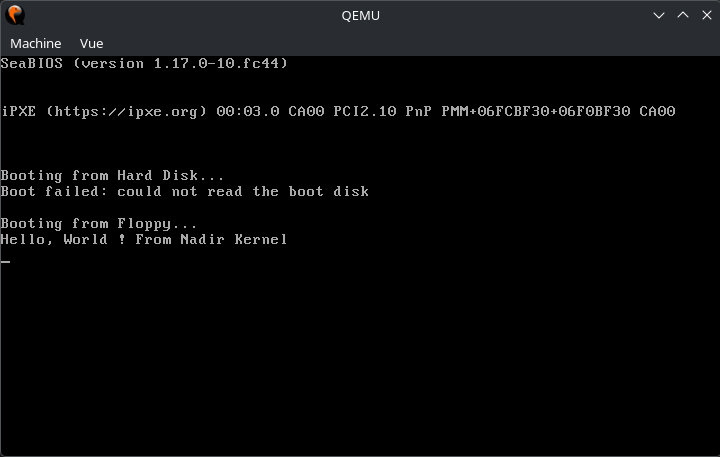

# Nadir Kernel

Nadir is an x86-64 kernel written from scratch. 
The name Nadir comes from the Arabic word *naẓīr*. In astronomy it means the point of lowest elevation, in  opposition to the zenith. The documentation assumes general knowlege about how operating systems work.

## Status of the project

The project is in its foundation phase and is not yet usable. Only the bootloader is currently being written.

## Getting started

### Prerequisites

You need two tools:

- **nasm** to assemble `boot.asm` into a bootable image.
- **qemu-system-x86_64**, the emulator used to run it.

Install both from your package manager:

**Debian / Ubuntu**
```bash
sudo apt install nasm qemu-system-x86
```

**Fedora**
```bash
sudo dnf install nasm qemu-system-x86
```

**Arch Linux**
```bash
sudo pacman -S nasm qemu-desktop
```

**macOS (Homebrew)**
```bash
brew install nasm qemu
```

**Windows**

I can only recommend using Linux distribution, but the Windows Subsystem for Linux is a valid path if you are exclusively running Windows. Install Ubuntu from the Microsoft Store, then run the Debian command above inside its terminal (QEMU's window renders automatically through WSLg).

### Running the kernel

From the repository root:

```bash
nasm -f bin boot.asm -o boot.bin
qemu-system-x86_64 -fda boot.bin
```

A QEMU window opens and you should see this:



Notes:

- `-fda` boots the image as a BIOS floppy. QEMU's default firmware loads it at address `0x7C00` and executes it in 16-bit real mode.
- `boot.bin` is a generated artifact and is ignored by git, so you need to build it first. `rm boot.bin` cleans up and it will regenerates on the next `nasm` run.
- There is no build script or Makefile yet. Those two commands are the whole toolchain.
- Running over SSH or in a bare terminal? Add `-display curses` to render the boot screen as text instead of a window:
  ```bash
  qemu-system-x86_64 -fda boot.bin -display curses
  ```
  Quit with `Ctrl-A` then `X`.

### Troubleshooting

| Symptom | Cause |
|---|---|
| `Boot failed: not a bootable disk` | `boot.bin` is not a valid boot sector: it must be exactly 512 bytes and end with the `0xAA55` boot signature. Re-run the `nasm` step and check it completes without errors. |
| Black screen / blinking cursor | The boot sector only speaks legacy BIOS (`int 0x10` text mode). This works out of the box with QEMU's default SeaBIOS firmware but will not boot under UEFI-only firmware (or UEFI-only real hardware) unless legacy/CSM boot is enabled. |
| No window appears under WSL2 | Use the `-display curses` variant above. It should work in any terminal. |
